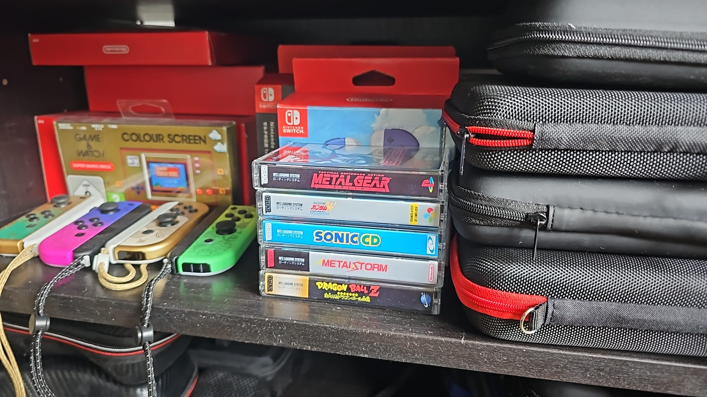
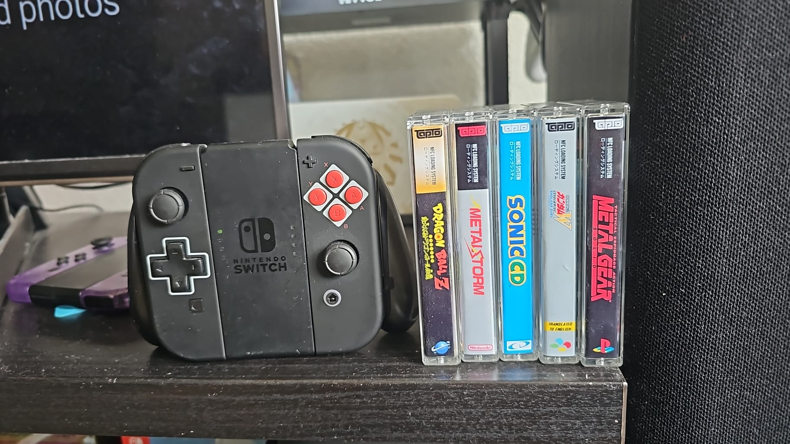
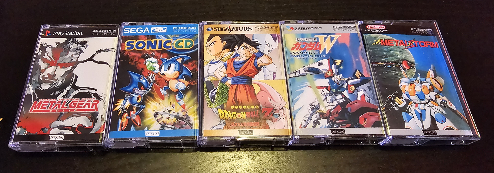
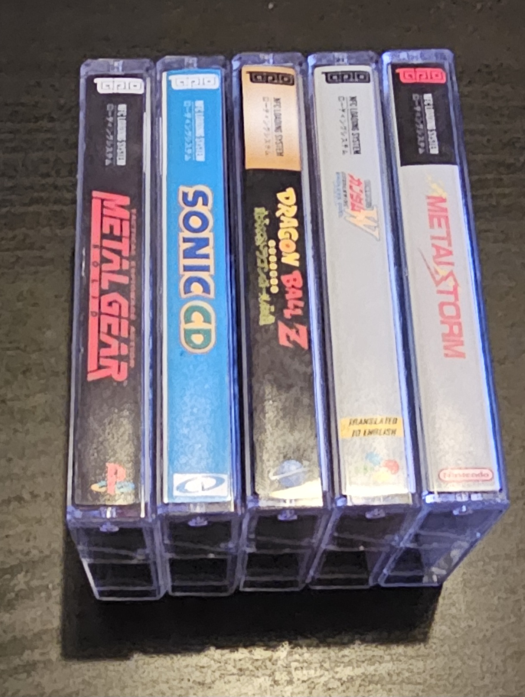
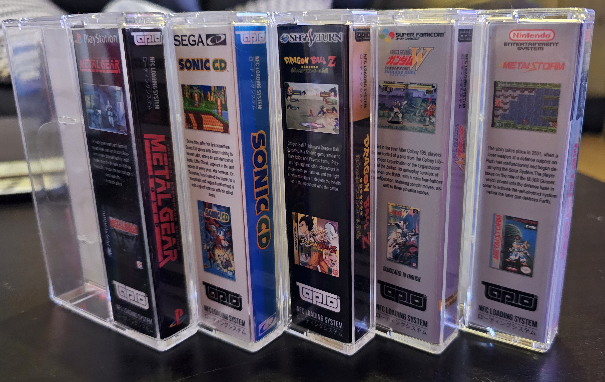
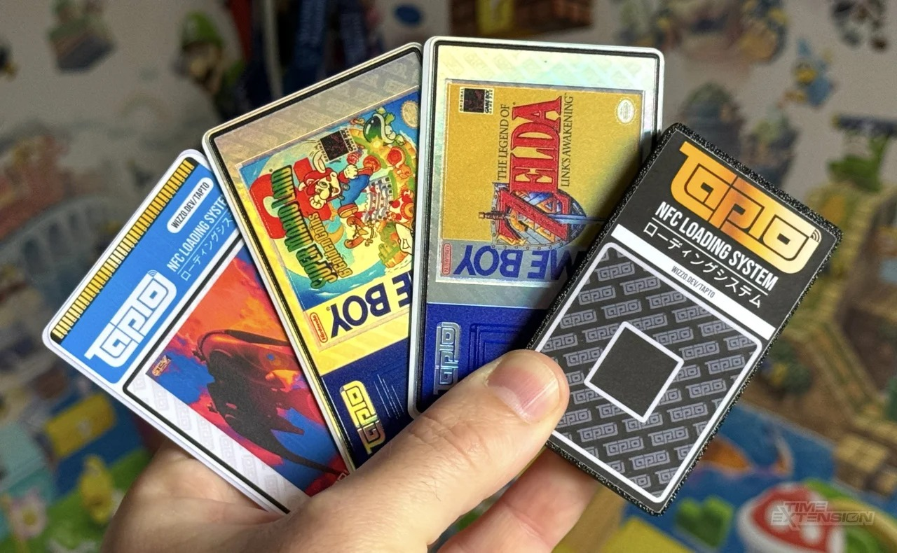

# TapToCassetteCovers

## Intro:

With the advent of digital gaming, more and more physical media starts to disappear. Whether it be because of practicability, laziness or simply, damage. This is why I decided that I wanted to spice my digital collection up a bit, by having something physical again without filling my closed with a massive collection of boxes. 

What to do, what to do. I decided that going the route of sourcing all these games on the internet was a no go. For starters, some of these games can be extremely expensive not to mention rare to find. And even in the rare instances you do find the game you’re looking for, you would be hard pressed to have it in any kind of decent condition for a ‘good’ price as some of these games are getting close to 40 years old!

## Showcase:

Cue these self-made cassette tape covers. With a little bit of photoshop magic and some old cassette tape cases lying around, you can make some wonderful things! These cassette tape cases offer multiple benefits to the original boxes of games.
First of all, they are cheap. They can be had for a coupe of bucks at any second hand store and some people even give them away for free!
They are small but not TOO small. In fact I think they are the perfect size. Some game boxes like the NES were pretty nice to look at but they were bulky and large, especially if you had over a hundred of them. Even if you could get your hands on them they would take a tremendous amount of space on your shelf/closet/wall. You could have a decent collection of these and still have enough room for all your other stuff. 

## Front:

## Side:

## Back:

Finally, what ‘digital’ media to use them for, and how? Cue the TapTo project! This amazing project allows you to use a NFC tag with a NFC-reader and have it boot up a game digitally! Currently it works with the MiSTer Project and with more to come (Windows, Linux, Batocera etc.)! 

If you want to learn more about how to do this with your own, follow this guide: https://tapto.wiki/Getting_Started

_source: timeextension.com_

Luckily for us, all different kinds of shaped and sized NFC cards, chips, tags etc. fit in these cassette tape cases! People are even making inserts so they can store their NFC cards in these cases so they have a snug fit without rattling. 

**Happy Gaming!**

# Dimensions:

System Dimensions for the TapTo NFC system. For use with Cassette Tape Cases to store your NFC Cards.
Simply download the desired PNG in the code area.

Print width: 	4,11"	(10,44 CM)
Print Height: 	4"	(10,16 CM)

